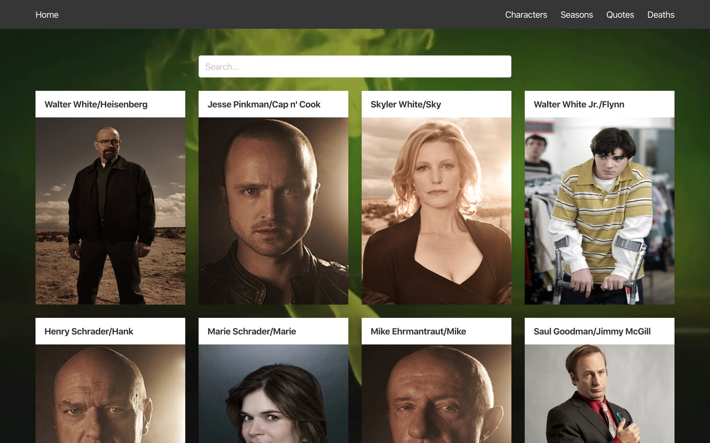
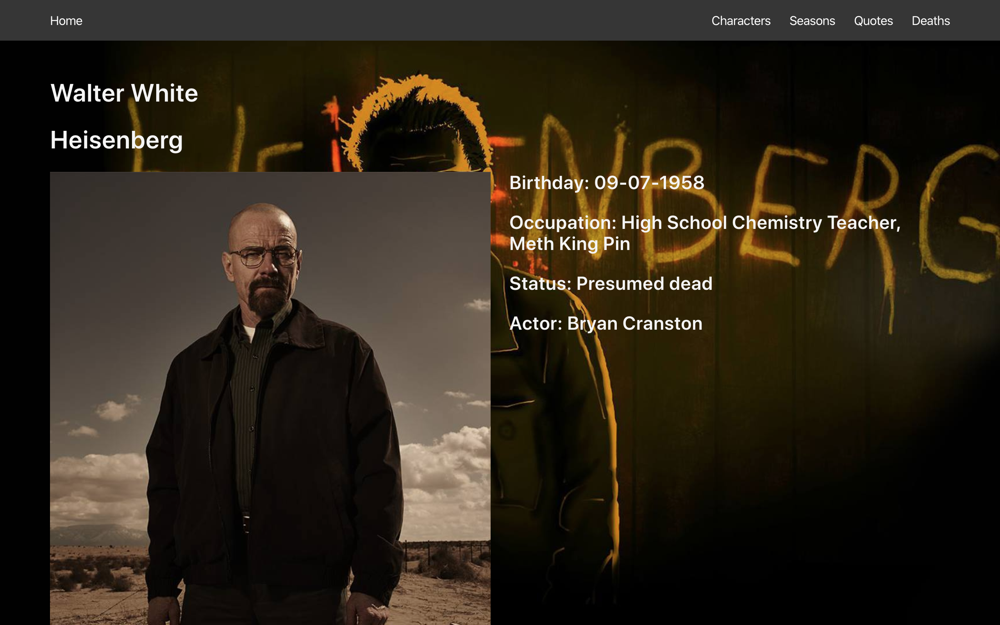
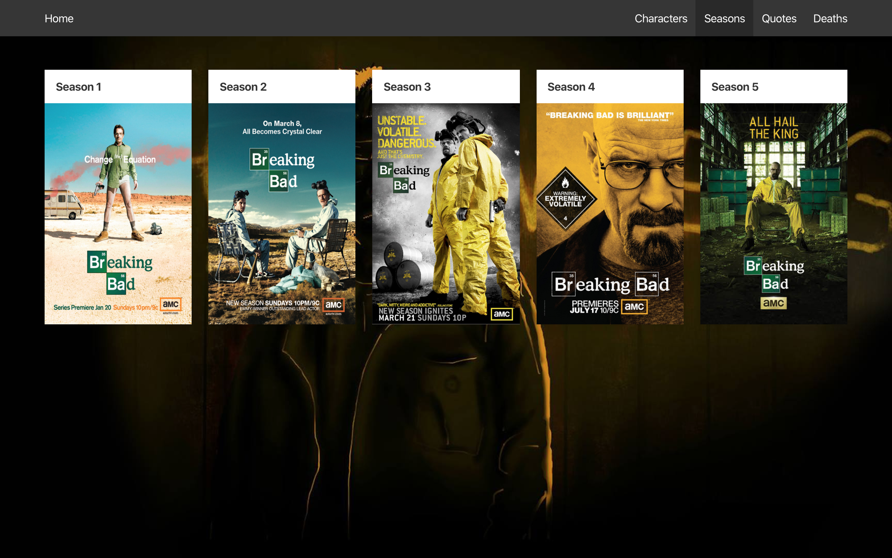
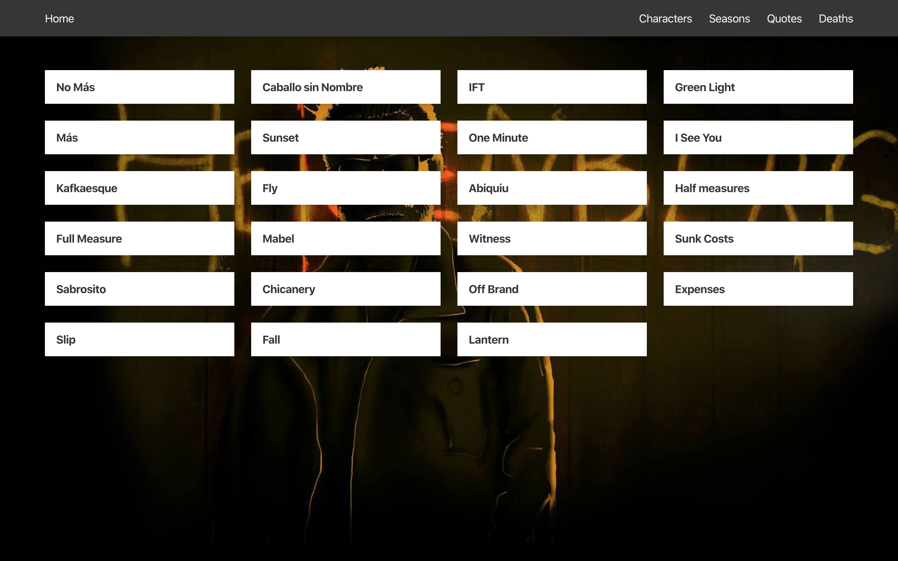
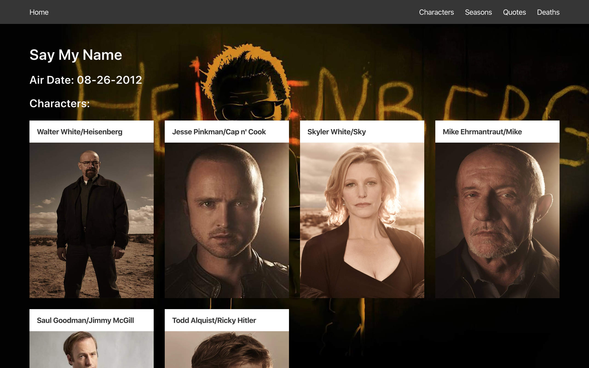
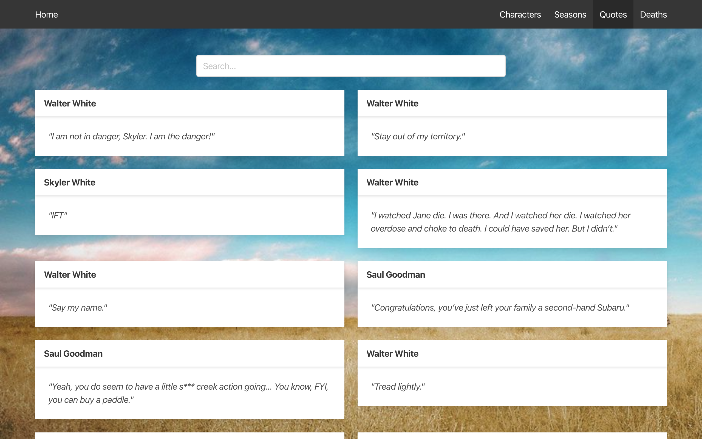
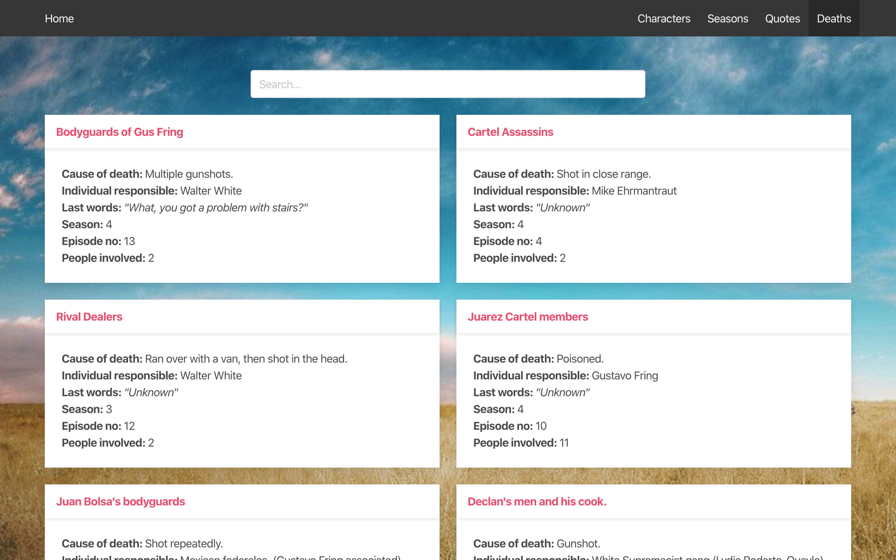

# reactathon
Software Engineneering Immersive: Project 3 (Group Project)

This was a pair project assigned for the Software Engineering Immersive at General Assembly London (Week 5) built with React.js.

## Team members:
- Xuan Wang (https://github.com/mmxw)
- David Campbell (https://github.com/davidcampbell-01)

## Built With

1. HTML
2. Bulma
3. JavaScript
   * ECMAScript6
   * React.js
   * Express.js
   * axios
5. GitHub

# User Experience

## Homepage

We designed out homepage to be minimal with just a navbar and background. We found that the use of a stretched gif image rendered poorly on the page after running the server, hence we used the ‘react-youtube-background’ package to display a YouTube video as a background.


#
## Viewing Characters

The character index page allows the user to search through the list of characters returned by the API. The user is presented with a full list of all characters and their names on the index page. Each character image has been sized to fit a uniform 2x3 card size, though the various length of names sometimes creates inequal boundaries for the cards.



#
## Viewing a single character

Each character card on the index page (above) contains a link to the relevant id of the focused character. Upon clicking, the user will be redirected to the page that contains the character information nested within the relevant section of the API.



#
## Viewing Seasons

Seasons can be viewed by navigating to the ‘seasons’ link in the navbar. The user will be presented with the five seasons as five cards, uniform in size. Each season card links to an index page displaying each episode within that season (pictured below).




#
## Viewing a single episode

The episode view page displays the air date of said episode, the title of it and the characters involved in the episode.



#
## Quotes and Deaths

The various quotes and deaths of each character can be accessed via their respective links in the navbar. Each page will display its data as an index of cards which display the necessary information, which includes the character name at the top followed by contents below.




#
## Error Page

The error page will be thrown whenever an unknown route is entered in the navigation bar of the browser.


#
## Planning

-- BACKEND --

The backend of the application was obtained via a web search for an API. We chose the Breaking Bad API as it has a lot of content that we could work with and was a topic of interest to both me and Xuan.

-- FRONTEND --

The task required the use of React.js for the development of the frontend. 

## Project Management

We structured the ten days we had as follows:
Day 1:
  - Locating a suitable API
  - Planning each page
  - Starting to code

Day 2:
  - Continued to code
  - Styling
  - Presentation

## Challenges & future improvements

The following code illustrates the challenge we faced when trying to obtain two different data sets from within the API. We worked tirelessly to find the solution to this problem, and eventually got the data to return in the console.log. From there, it was simply a matter of rendering the data on the user interface:

```
 await axios.all([
        axios.get('https://breakingbadapi.com/api/episodes'),
        axios.get('https://breakingbadapi.com/api/characters')
      ])
        .then(axios.spread((epRequest, charRequest) => {
          this.setState({
            episode: epRequest.data[episodeId()],
            allCharacters: charRequest.data
          })

        }))
```

We wanted to include a search feature on the page which would filter the list according to the user’s choice of words, matching the user input to a character’s name in real time. Xuan was happy to take on this task and did a fantastic job. The following code demonstrates the functionality of the search bar:
```
import React from 'react'

const SearchBar = ({ onChange }) => (
  <div className="columns is-centered">
    <div className="control column is-half">
      <input
        type="text"
        className="input"
        placeholder="Search..."
        onChange={e => {
          const userInput = e.target.value
          onChange(userInput)
        }}
      />
    </div>
  </div>
)

export default SearchBar
```